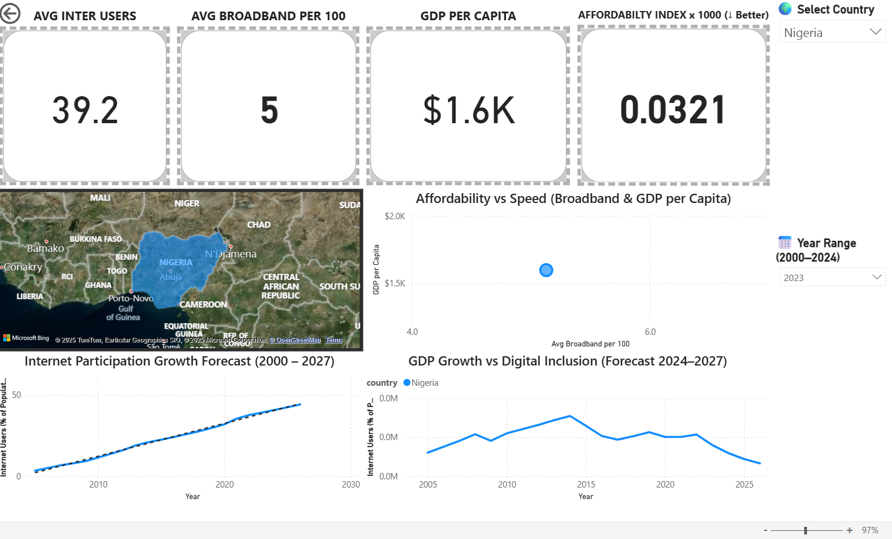

# 🌍 DIGITAL DIVIDE DASHBOARD

### Can you really work from anywhere

This project explores the relationship between **internet accessibility**, **affordability**, and **income** across countries, asking a simple but powerful question:

> Where is the internet truly fast, affordable, and inclusive enough for remote work, learning, and opportunity?

---

## 📊 Project Overview

**Python** – Extracted datasets directly from the World Bank API,Cleaned, merged, and prepared datasets from global broadband and World Bank sources  
**SQL (MySQL Workbench)** – Structured tables, validated data integrity, and performed exploratory queries  
**Power BI** – Created interactive dashboards with affordability index calculations, visual analytics, and three-year forecasting  

---

## ⚙️ Tech Stack

| Stage | Tool | Purpose |
|--------|------|----------|
| Data Cleaning | Python (Pandas) | Clean and merge broadband and GDP data |
| Data Modelling | MySQL | Structure schema and run validation queries |
| Visualisation | Power BI | Build interactive dashboard and forecasts |
| Analytics | DAX | Calculate Affordability Index and project growth |

---

## 🧮 Key Metrics

**Affordability Index (×1000 ↓ Better)**  
`Broadband Subscriptions per 100 ÷ GDP per Capita`

**Forecast Period:** 2025–2027  
Predicts growth in internet participation and GDP correlation  

---

## 🗺️ Dashboard Sections

1. **KPI Overview:** Internet Users, Broadband Density, GDP, and Affordability Index  
2. **Map View:** Global digital access distribution  
3. **Scatter Plot:** Affordability vs Speed (Broadband vs GDP)  
4. **Forecast Trends:** Internet Participation (2000–2027) and GDP Growth vs Inclusion (2024–2027)  
5. **Interactive Filters:** Country and Year Range  

---

## 💡 Insights

• Speed does not equal accessibility. Some countries have high speeds but unaffordable plans  
• Mid-income nations often deliver better speed-per-cost efficiency  
• Affordability directly predicts participation in digital learning and remote work  
• Forecasts show narrowing digital gaps by 2027 with Africa and South Asia leading growth  

---

## 🧠 Why It Matters

Digital inclusion is not just infrastructure, it is empowerment.  
When internet affordability rises, so does access to education, jobs, and innovation.  

---

